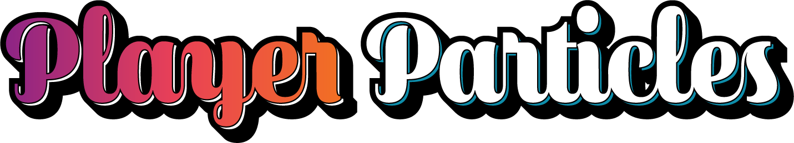

## What is PlayerParticles?
PlayerParticles is a particle plugin designed for players and blocks.

## Support
If you need any help with our plugins, including any questions to ask, any bugs to report, or you just want to chat, [join our Discord server](https://discord.gg/MgUsTBK)!  We offer all support through our server, so feel welcome to join if you need any assistance.

## Download & Installation
### How to Install
To install the plugin from Spigot, [visit our Spigot page](https://www.spigotmc.org/resources/playerparticles.40261/) and hit the big download button to download the jar file.  Make sure your server is turned off first, and then put that jar file into your server's `/plugins` folder.  After it's in the folder, go ahead and start up your server.  After your server is finished starting up, you should be able to find a PlayerParticles folder in the `/plugins/PlayerParticles` directory, which contains all of the configuration files and data files for PlayerParticles.

### Alternative Download & Installation
In a more advanced method, you can compile the plugin yourself from GitHub.
PlayerParticles uses Gradle to compile and build the plugin.  To use this method, run `./gradlew build` in the project's root directory to build the jar.  The plugin jar should be located in `./build/libs` when finished.